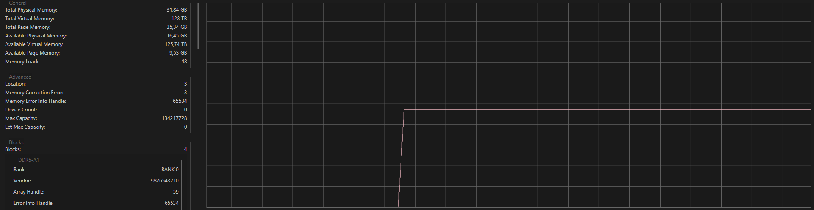

# Welcome to usage walkthrough

# Basic Usage

## Main Page

---
### On the Lower side of the window you can see system information profiling like (CPU, GPU, RAM) and more in the future.
#### - [CPU Profiling](#cpu-profiling)
#### - [GPU Profiling](#gpu-profiling)
#### - [RAM Profiling](#ram-profiling)
---
### On the upper side of the window you can see function buttons and a bit lower the main page with.
#### [Function Buttons](#function-buttons)
#### [Process Profiling](#process-profiling)
---

# Function Buttons
## CURRENTLY UNAVAILABLE

# Process Profiling
## When it comes to process profiling you can open process properties by double clicking on it in the process list.

## After opening process properties a window will popup and from there you have multiple page options.

### General Page
#### General process information like: name, description, version etc.
#### You can copy content of the text boxes by pressing small button to the right of it.

### Statistics Page
#### Live process statistics like priorities, ram usage, process CPU times, etc. 

### Performance Page
#### Live process CPU and RAM usage.

### Threads Page
#### Page of all process threads (updates when reopening the page).

### Handles Page
#### Page of all process handles (updates when reopening the page).

### Modules Page
#### Page of all process modules (updates when reopening the page).

---

# CPU Profiling

### Main CPU Page.

### CPU General Information
#### Basic CPU data like: name, vendor, frequency, etc.

### CPU Times Information
#### Informations about CPU times.

### CPU Advanced Information
#### Informations about more advanced CPU data.

### CPU Cache Information
#### Informations about all CPU caches.

---

# GPU Profiling

### Main GPU Page

### GPU General Information
#### Basic GPU data like: name, vendor, utilizations, etc.

### GPU Advanced Information
#### Informations about more advanced GPU data.

---

# RAM Profiling

### Main RAM Page

### RAM General Information
#### Basic RAM data like: name, vendor, utilizations, etc.

### RAM Advanced Information
#### Informations about more advanced RAM data.

### RAM Block Information
#### Informations about all RAM blocks.

